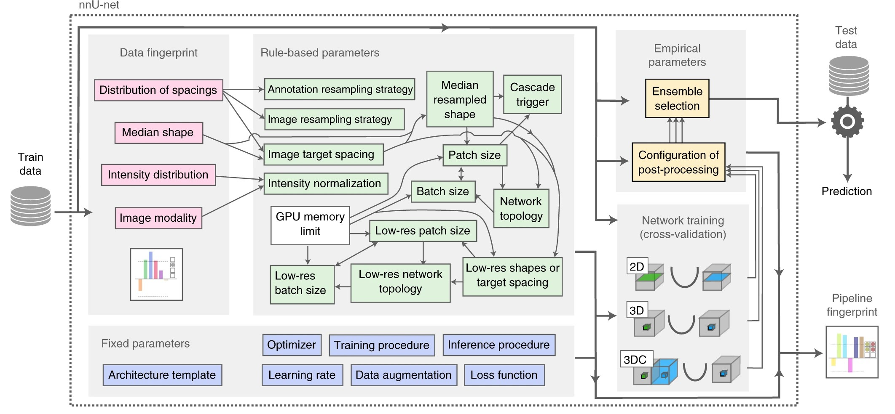

# 认识 nnUNet

## 为什么是 nnUNet
毫无疑问，UNet[1](#ref1) 几乎是卷积神经网络在医学图像分割领域的基线模型，也出现了许多 UNet 的改进版本，
如：V-Net[2](#ref2)，UNet++[3](#ref3)，nnU-Net[4](#ref4)，U2-Net[5](#ref5) 等。
但在所有改进版本中，nnUNet 作为是一种自适应框架，使用者只需要输入数据，nnUNet 动根据图像几何结构在网络架构、预训练、训练、推理方向上调整自身结构，
实现全自动分割流程，取得许多分割任务的 SOTA，成为许多创新方法对比的又一个 baseline。

nnUNet 框架下包含了数据预处理、网络框架设计、预测结果后处理、参数自动推理，这是一个深度学习医学图像分割，
甚至是医学图像处理的一个非常好的学习示例，如果你也想来入坑，那就让我们开始吧！

## nnUNet 工作流程
不同于自然图像，医学图像含有着许多特有的属性信息，如：模态（X-ray、CT、MRI）、体素大小（SpacingSize）、窗宽窗位（Window Width and Widow Level），
nnUnet 基于图像的这些“**指纹**”来自动推理预处理和网络参数，而这恰恰就是 nnUNet 最迷人的一个重要点，其工作流程：

给定一个新的分割任务，nnUNet 会提取“数据集指纹”（粉红色）；进而，根据“数据指纹”启发式推断的数据相关“基于规则的参数”（绿色）；
最后，根据预定义的“固定参数”（蓝色）来确定训练和测试策略，并确定是否需要后处理的“经验参数”（黄色），自动完成全流程操作！

**参考文献**

[1] U-net: Convolutional networks for biomedical image segmentation.

[2] V-Net: Fully Convolutional Neural Networks for Volumetric Medical Image Segmentation.

[3] UNet++: A Nested U-Net Architecturefor Medical Image Segmentation.

[4] nnU-Net: a self-configuring method for deep learning-based biomedical image segmentation.

[5] U2-Net: A Bayesian U-Net Model with Epistemic Uncertainty Feedback for Photoreceptor Layer Segmentation in Pathological OCT Scans.

